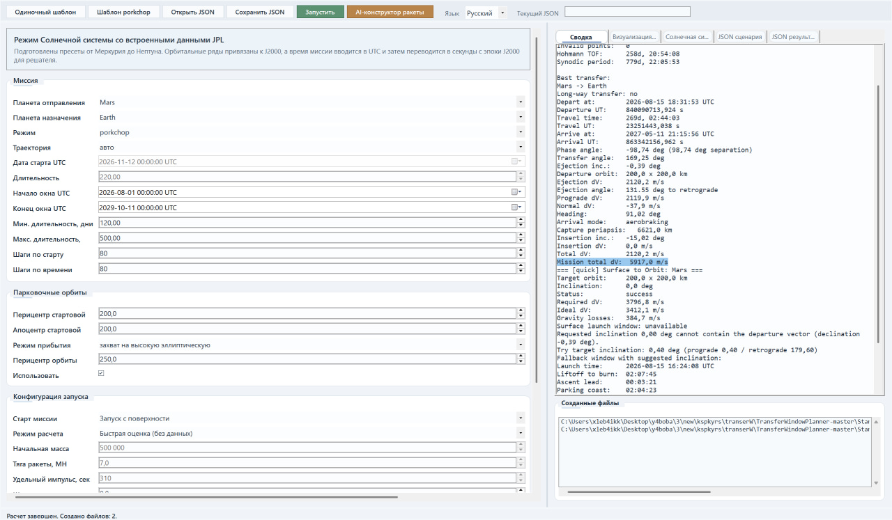
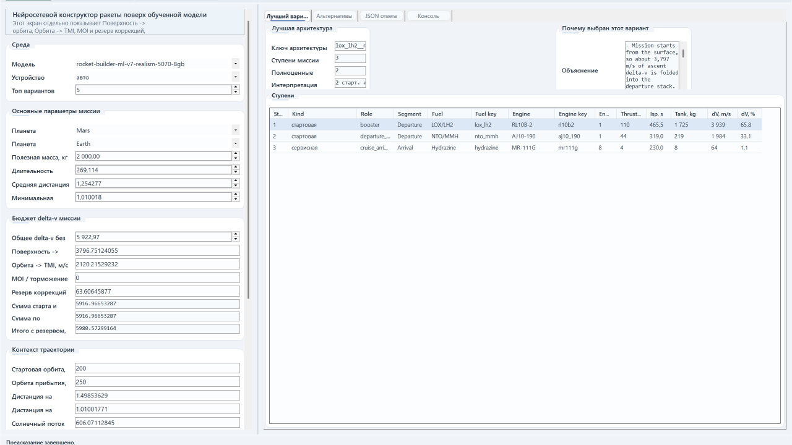

# TransferWindowPlanner-master

Описание на русском и технические детали — как работают поиск окон перелёта, Ламберт-решатель и обучение модели для построения ракеты.

**Кратко:**
- Этот репозиторий содержит инструменты для расчёта межпланетных окон перелёта (porkchop), локальный C# движок расчёта траекторий (включая `LambertSolver`) и набор модулей для генерации датасета и обучения нейросети, которая ранжирует варианты конструкций ракеты (rocket-builder-ml).
- Сценарии и GUI находятся в `StandaloneTrajectoryCalculator` / `StandaloneTrajectoryCalculator.Gui`, генерация наборов данных — в `FuelDatasetGenerator`, обучение модели — в `rocket_builder_ml`.

**Как находятся окна перелёта (porkchop / поиск):**
- Для поиска окон перелёта используется класс `PorkchopCalculator` (файл [StandaloneTrajectoryCalculator/PorkchopCalculator.cs](StandaloneTrajectoryCalculator/PorkchopCalculator.cs#L1-L400)).
- Алгоритм: задаётся прямоугольная сетка по времени старта (departure) и времени полёта (time-of-flight). По каждому узлу сетки вычисляется трансфер через `TransferCalculator.CalculateTransfer`.
- `TransferCalculator` для конкретной пары (departure, travelTime) запрашивает позиции тел в мировых координатах, принимает решение о коротком/длинном пути (long-way) по знаку угла между радиус-векторами и вызывает `LambertSolver` для решения задачи Ламберта. Результатом является вектор начальной и конечной скоростей трансфера, затем вычисляются ejection/insertion ΔV, проверяются парковочные орбиты, возможные захваты и суммарный ΔV (см. [StandaloneTrajectoryCalculator/TransferCalculator.cs](StandaloneTrajectoryCalculator/TransferCalculator.cs#L1-L400)).
- После обхода сетки формируется карта значений ΔV (porkchop), выбираются минимумы — это и есть рекомендуемые окна перелётов.

**Задача Ламберта и реализация `LambertSolver`:**
- Задача Ламберта: по двум позиционным векторам r1, r2 и заданному времени перелёта TOF найти начальную и конечную скорости свободной орбитальной траектории в задаче двух тел (с учётом центрального гравитационного параметра μ).
- В этой реализации (`StandaloneTrajectoryCalculator/LambertSolver.cs`):
	1. Используется формализм универсальной переменной (universal variable formulation) и функции Стампа (Stumpff C, S).
	2. На вход подаётся μ, `position1`, `position2`, `timeOfFlight` и флаг `longWay` — выбор длинного ветвления (angle > π).
	3. Вычисляются геометрические величины: длины r1, r2, косинус/синус угла между векторами, параметр трансфера (transferParameter).
	4. Решается нелинейное уравнение времени полёта относительно универсальной переменной z: реализованы методы `FindUniversalVariable`, `FindUniversalVariableBracket`, `TryUniversalTimeOfFlight`, `TryUniversalGeometry`. Поиск корня производится методом бика/дихотомии в рамках ограничений, с перебором/сканированием, если требуется. Вариативность z (положительная / отрицательная / ~0) корректно обрабатывается.
	5. Для найденного z вычисляются функции Стампа `StumpffC(z)` и `StumpffS(z)` (включая разложения в ряд для малых |z|), затем Lagrange-коэффициенты f, g и gDot, по ним вычисляются вектора скоростей:
		 - `velocity1 = (r2 - r1 * f) / g`
		 - `velocity2 = (r2 * gDot - r1) / g` (возвращается через out-параметр)
	6. Проверки и исключения: если геометрия вырожденная или коэффициенты близки к нулю — выбрасываются `InvalidOperationException`.
- Код `LambertSolver` аккуратно реализует бенчмаркет и устойчивость: сканирование диапазона z, бракетирование корня, численная сходимость и защита от сингулярностей — подробнее в файле [StandaloneTrajectoryCalculator/LambertSolver.cs](StandaloneTrajectoryCalculator/LambertSolver.cs#L1-L400).

- Часть логики расчёта окон перелёта и сама идея porkchop/lambert была взята и адаптирована из открытого проекта TransferWindowPlanner (https://github.com/TriggerAu/TransferWindowPlanner). В этой ветке код переработан под автономные утилиты и расширен генератором датасетов (`FuelDatasetGenerator`) и Python-частью для обучения / предсказания.

**Генерация датасета и использование расчётов для обучения:**
- Генератор наборов данных: `StandaloneTrajectoryCalculator/FuelDatasetGenerator.cs`.
	- Сэмплинг миссий: случайный выбор пары планет (origin/destination), случайная дата старта внутри заданного диапазона и время полёта, выбор вокруг Hohmann-ориентированной оценки с вариацией множителей.
	- Для каждого кандидата вызывается `TransferCalculator.CalculateTransfer` — оттуда берутся суммарный ΔV (`DVTotal`), ΔV эжекции/инжекции, углы и расстояния от Солнца. Миссия отвергается, если трансфер невалиден или ΔV вне допустимого диапазона.
	- Для валидных миссий формируются профильные «стадии» (stage profiles) с набором кандидатов топлива и затем перебираются архитектуры двигателей/топлива. Для каждой архитектуры оценивается масса ступеней, боил-офф, масса баков, сухая масса и итоговая стартовая масса; применяется набор штрафов (реалистичность, хранение крёо-топлива и т.д.) и считается итоговая метрика `score_kg_equivalent`.
	- Результатом генерации являются два CSV: `mission_dataset.csv` и `architecture_dataset.csv`, и метаданные. Эти CSV — вход для обучения модели в `rocket_builder_ml`.

**Обучение модели (rocket_builder_ml):**
- Скрипт обучения: `rocket_builder_ml/train.py`. Основные шаги:
	1. `load_architecture_training_frame` собирает и обогащает CSV (производные признаки, stage-features и т.д.). Полный список числовых признаков — в `rocket_builder_ml/data.py:NUMERIC_FEATURE_COLUMNS`.
	2. Формируется `ModelMetadata`, `ArchitectureDataset` (PyTorch Dataset) с нормализацией и тензоризацией.
	3. Модель — `ArchitectureRanker` (`rocket_builder_ml/model.py`): резидуальные MLP-блоки (`ResidualMlpBlock`) + эмбеддинги для пропелланта, двигателя, позиции ступени, эмбеддинги для тел (origin/destination). Выходы:
		 - основная голова: логарифм предсказанного `score` (целевой показатель), предсказанные логи массы запуска и boiloff;
		 - вспомогательная голова: dry/tank/tank-carry и т.д.;
		 - головы распределения ΔV по ступеням (`stage_dv_share`) и распределения бака по ступеням (`stage_tank_share`) — через masked softmax.
	4. Функция потерь: композиция Huber-loss (smooth L1) для нескольких лог-таргетов + регуляризатор на чрезмерную долю ΔV в крёо-ступенях при длительном хранении (специальный cryo-excess loss). Веса компонент приведены в `train.py` и сглаживают вклад разных метрик.
	5. Оптимизация: `AdamW`, LR-схема c warmup + косинусным спадом, clip-grad и AMP (опционально для CUDA). Ранний стоп по валидации.
	6. Сохранение: `model.pt`, `metadata.json` и `metrics.json` в указанную директорию.

**Ограничения и замечания по ΔV и инженерным допущениям:**
- Расчёты трансферов и суммарного ΔV, получаемые через `LambertSolver` и `TransferCalculator`, дают идеализированную оценку необходимого ΔV. Они вычисляют минимальную математически-возможную импульсную потребность при предположении точного исполнения манёвров в вакууме и без дополнительных потерь.
- В реальности всегда присутствуют непредвиденные потери: неидеальная отработка движков, аэродинамические потери на запуске/вхождении в атмосферу, манёвры коррекции, неполадки, дополнительные манёвры для точной вставки в целевую орбиту и др. Поэтому реальный требуемый ΔV обычно больше рассчитанного.
- Иными словами, результат модели соответствует идеальному "теоретическому" перелёту между планетами; для практических расчётов рекомендуется добавлять запас (margin/reserve ΔV) и инженерные поправки.
- Модель обучения и генератор датасета содержат механизмы защиты от искусственно «худших» архитектур: регуляризации, штрафы за непрактичные комбинации, ограничения на число ступеней и "реалистичность" архитектуры. Тем не менее бывают случаи, когда математически выгодная конфигурация (например, множество тонких ступеней с низкой массой) оказывается инженерно невыгодной или слишком дорогой в производстве.
- Работа над этими инженерными ограничениями продолжается: в коде уже есть частичные решения (штрафы за хранение крёо-топлива, ограничения на число ступеней, корректировки реалистичности), и ведётся дальнейшая доработка для более точного учета производственных и эксплуатационных ограничений.

**Скриншоты**
- **Главный экран:**  
	  
	Файл: [screenshots/main.jpg](screenshots/main.jpg)
- **Экран генератора ракеты:**  
	  
	Файл: [screenshots/ai.jpg](screenshots/ai.jpg)

**Ключевые файлы для изучения:**
- `StandaloneTrajectoryCalculator/LambertSolver.cs` — реализация решения задачи Ламберта.
- `StandaloneTrajectoryCalculator/TransferCalculator.cs` — вычисление ΔV, обработка парковочных орбит и ejection/insertion.
- `StandaloneTrajectoryCalculator/PorkchopCalculator.cs` — обход сетки (porkchop) и выбор лучшего трансфера.
- `StandaloneTrajectoryCalculator/FuelDatasetGenerator.cs` — генерация миссий и архитектур для обучения.
- `rocket_builder_ml/data.py` — формирование признаков из CSV.
- `rocket_builder_ml/model.py` — архитектура нейросети `ArchitectureRanker`.
- `rocket_builder_ml/train.py` — цикл обучения, лосс, ранний стоп, сохранение артефактов.

**Запуск (быстрый старт):**
- Установите зависимости (рекомендуется виртуальное окружение):

```powershell
python -m pip install -r requirements.txt
```

- Запуск GUI (требует .NET):

```powershell
.\\launch_rocket_builder.ps1 -Mode gui
```

- Обучение (использует `rocket_builder_ml/run.ps1`):

```powershell
.\\launch_rocket_builder.ps1 -Mode train
```

**Примечание:** `launch_rocket_builder.ps1` — главныйLauncher-скрипт: он запускает GUI (.NET), porkchop-утилиту (.NET) или Python-часть (predict/train) в зависимости от выбранного режима (см. файл `launch_rocket_builder.ps1`).

**Лицензия и благодарности:**
- Этот проект содержит переработки и собственные расширения на базе открытого репозитория https://github.com/TriggerAu/TransferWindowPlanner — благодарности автору и ссылки на исходники. При распространении и использовании кода обратите внимание на лицензию в корне репозитория (`LICENSE`).


